# RokidHub · Codex: как управлять локальным Codex с очков Rokid

RokidHub · Codex связывает очки Rokid RV101 с Codex, работающим на твоём Windows‑ПК. Можно выбрать проект голосом, продиктовать задачу, следить за состоянием в HUD, продолжить текущий диалог или остановить его. При этом проекты, исходники, авторизация ChatGPT/Codex и локальные разрешения остаются на компьютере.

> Статус: публичная beta `v0.6.0-beta.1`. Начинай с режима «Только чтение». Windows‑приложение пока не имеет коммерческой Authenticode‑подписи, поэтому SmartScreen может показать предупреждение.

## Что входит в интеграцию

В системе четыре независимых компонента:

1. **Rokid RV101** — микрофон, HUD и короткое голосовое озвучивание результата.
2. **Rokid Nexus на Android** — запускает отдельный плагин `RokidHub · Codex`, предоставляет ему STT, HUD и TTS.
3. **RokidHub** — связывает устройства одного пользователя и передаёт ограниченные задания и статусы.
4. **RokidHub Desktop Connector** — исходящим HTTPS‑соединением получает задания, проверяет локальные правила и общается с установленным Codex App Server.

```text
Rokid RV101
    ↕ Bluetooth / Nexus
Nexus-плагин RokidHub · Codex
    ↕ HTTPS
RokidHub
    ↕ исходящий HTTPS polling
RokidHub Desktop Connector для Windows
    ↕ localhost / stdio
локальный Codex App Server → выбранный проект
```

На ПК не требуется открывать порт, настраивать IP‑адрес очков или делать проброс на роутере. Connector сам устанавливает исходящее защищённое соединение с Hub. В дальнейшем polling можно заменить исходящим WSS‑каналом, не меняя схему устройств и заданий.

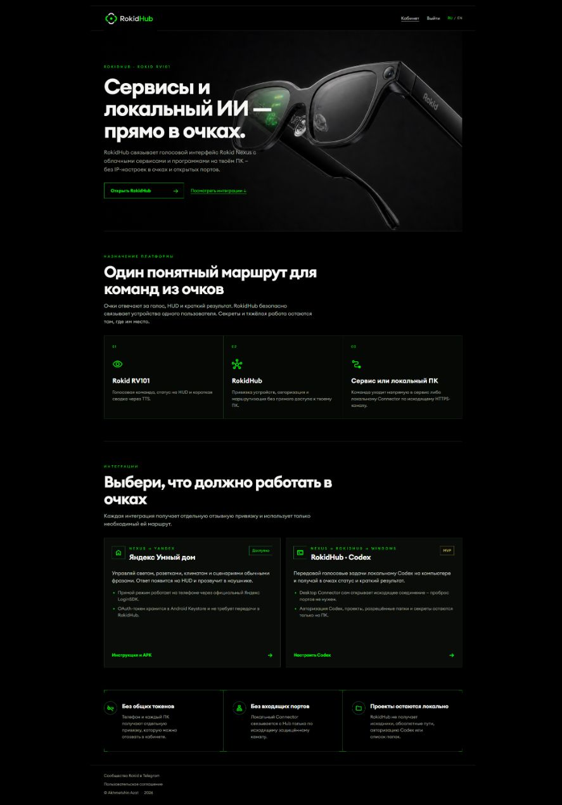

## Что остаётся локальным

Главная граница безопасности проходит на ПК.

| Данные | Где находятся |
|---|---|
| Авторизация Codex/ChatGPT | только в локальном Codex |
| Исходники, абсолютные пути, команды и патчи | только на ПК |
| Список разрешённых папок и выбранная политика доступа | только в Connector |
| Связь с локальными Codex thread/turn | только в Connector |
| Сырые токены устройств | в защищённом хранилище соответствующего устройства |
| Хеши отзывных токенов | в RokidHub |
| Голосовой запрос, короткий статус и итоговая сводка | временно проходят через RokidHub |
| Фото по явной голосовой команде | временно проходит через RokidHub и удаляется после однократной доставки или срока хранения |
| Показываемое имя проекта | короткий голосовой псевдоним без пути |

У Nexus‑плагина и каждого ПК разные идентичности и разные отзывные токены. Отвязка очков не раскрывает и не отзывает токен ПК, а отвязка компьютера не затрагивает Nexus. Hub маршрутизирует задания только между устройствами одного аккаунта.

## Загрузка

Актуальные файлы находятся в [GitHub Releases](https://github.com/lavAzza2/rokidhub-codex/releases/latest):

- `RokidHub-Desktop-Connector-v*.exe` — приложение для Windows;
- `RokidHub-Codex-Nexus-v*.apk` — плагин Nexus;
- `SHA256SUMS.txt` — контрольные суммы обоих файлов.

Исходный код опубликован в [репозитории RokidHub · Codex](https://github.com/lavAzza2/rokidhub-codex). Ссылки на APK, Connector и GitHub также есть в карточке интеграции в кабинете.

## 1. Подготовь локальный Codex

Установи Codex на Windows и авторизуй его обычным локальным способом. Connector не просит пароль, OAuth‑код или токен ChatGPT: он запускает `codex app-server` локально и общается с ним через stdin/stdout.

Перед настройкой полезно проверить в PowerShell:

```powershell
codex --version
```

Если команда не найдена, сначала исправь локальную установку или `PATH`. Передавать учётные данные на RokidHub не нужно.

## 2. Установи и настрой Desktop Connector

Скачай EXE из релиза и запусти его. При первом запуске Windows может показать SmartScreen, поскольку beta‑сборка пока не подписана Authenticode. Сверь SHA‑256 файла с `SHA256SUMS.txt` из того же релиза.

На вкладке **Обзор** сразу видны состояние ПК и очков, проект по умолчанию, режим доступа и последние локальные события. Пока ПК не привязан, кнопка запуска недоступна, а карточка очков сообщает, что сначала требуется привязать компьютер.

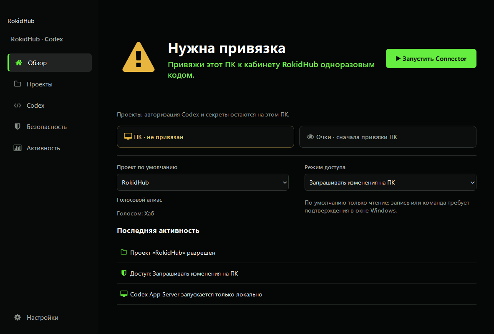

### Разрешённые проекты

Открой **Проекты** и добавь только те папки, с которыми разрешено работать голосовым заданиям. Для каждой папки можно задать до 12 голосовых псевдонимов — по одному в строке. Добавляй варианты, которые STT обычно слышит вместо настоящего названия, например `RokidCodex`, `Рокет Codex` и `Рокет кодекс`. Первый псевдоним используется как короткое отображаемое имя в HUD, а настоящее имя папки всегда остаётся дополнительным вариантом.

Радиокнопкой отметь проект по умолчанию. Он используется для новой задачи, если проект не выбран голосом. Абсолютный путь и полный список псевдонимов остаются локальными; Nexus и RokidHub получают только произнесённый и выбранный короткий псевдоним.

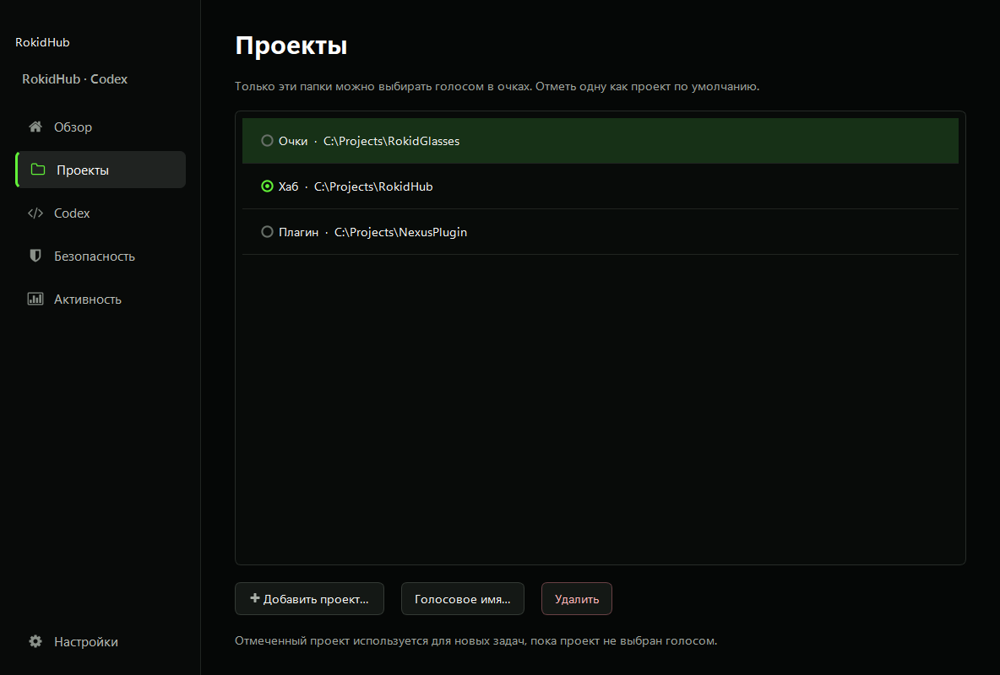

Примеры голосовых команд:

| Русский | English |
|---|---|
| «Выбери проект Хаб» | “Select project Hub” |
| «Открой проект Очки» | “Open project Glasses” |
| «Переключись на проект Плагин» | “Switch to project Plugin” |

После выбора Connector закрепляет проект за текущим разговором. Следующие команды относятся к тому же проекту, пока ты не выберешь другой.

### Модель, глубина анализа и скорость

На вкладке **Codex** можно оставить модель по умолчанию или выбрать одну из моделей, которые сообщает установленный локальный Codex. Там же задаются глубина анализа и режим скорости. Эти параметры передаются только локальному App Server.

Кнопка **Обновить список** перечитывает доступный каталог из установленного Codex. **Mock‑режим** полезен для проверки связи и интерфейса без запуска реального задания.

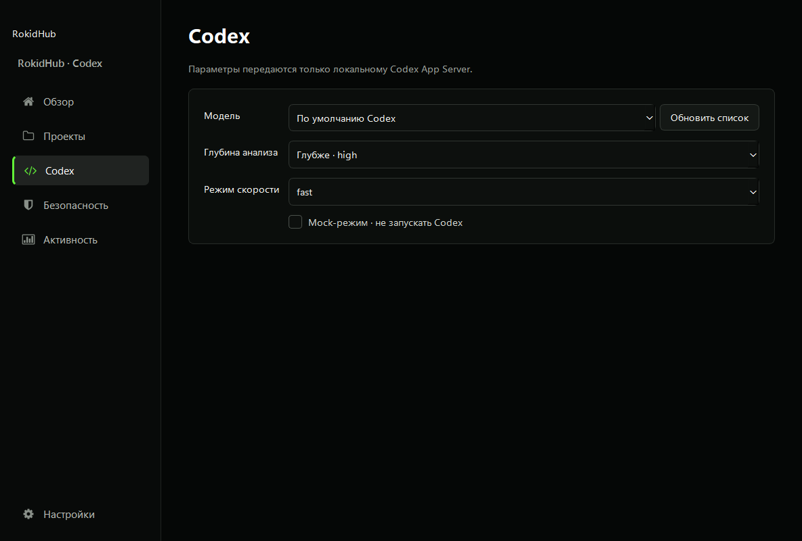

### Режим доступа

На вкладке **Безопасность** выбирается локальная политика:

- **Только чтение** — анализ без изменения файлов;
- **Запрашивать изменения на ПК** — чтение разрешено, а запись или команда требует подтверждения в окне Windows;
- **Полный доступ к выбранному проекту** — обычные недеструктивные изменения только внутри выбранной папки.

Даже третий режим не разрешает произвольный доступ ко всему компьютеру: сеть выключена, выход за выбранный проект запрещён, опасные и внешние действия автоматически не выполняются. Режим `dangerFullAccess` отсутствует намеренно.

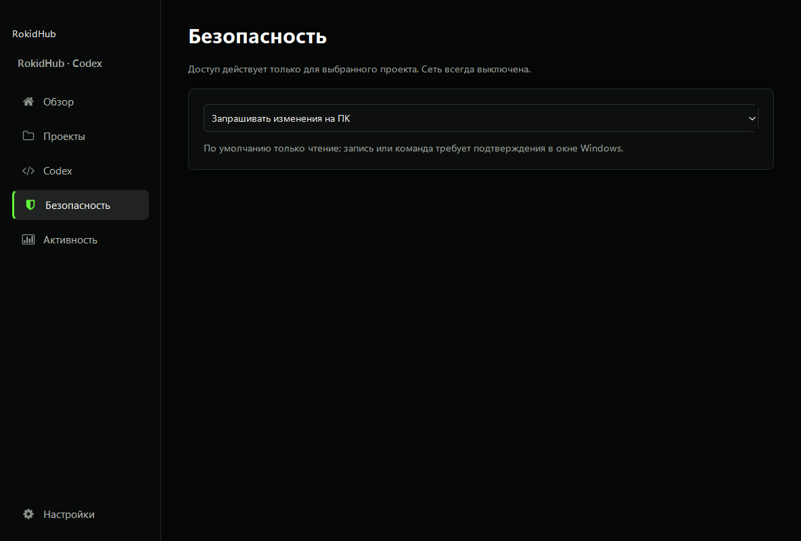

### Привязка ПК, язык и автозагрузка

На вкладке **Настройки** укажи имя компьютера, проверь адрес `https://rokidhub.com` и нажми **Привязать ПК**. Connector остановит текущий рабочий цикл, покажет одноразовый код и будет ждать подтверждения в кабинете.

Здесь же можно включить запуск после входа в Windows и выбрать русский, английский или автоматическое определение по языку Windows. Крестик окна сворачивает работающий Connector в системный трей. Полный выход выполняется через меню значка в трее → **Выход**.

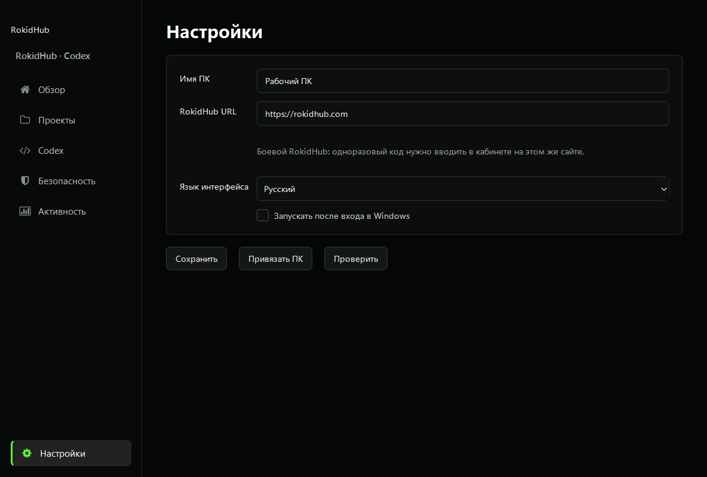

## 3. Привяжи ПК в кабинете RokidHub

Войди в [rokidhub.com](https://rokidhub.com), открой **Кабинет → RokidHub · Codex** и введи одноразовый код из Connector. После успешной привязки поле кода скрывается, а вместо него появляется состояние устройства и кнопка **Отвязать**.

На сводной странице обе интеграции показаны одинаковыми мини‑виджетами. Карточка Яндекс Умного дома справочная, потому что её авторизация проходит по правилам самого Яндекса. Карточка Codex ведёт к настройке устройств и загрузкам.

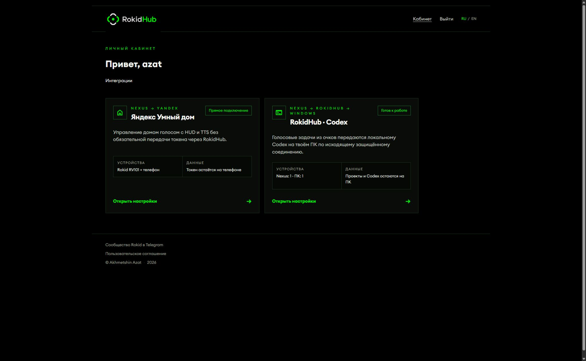

В подробной карточке отдельно показаны Nexus и Desktop Connector. Для готовой работы оба состояния должны быть зелёными. Токены у них разные, поэтому каждый компонент привязывается своим кодом.

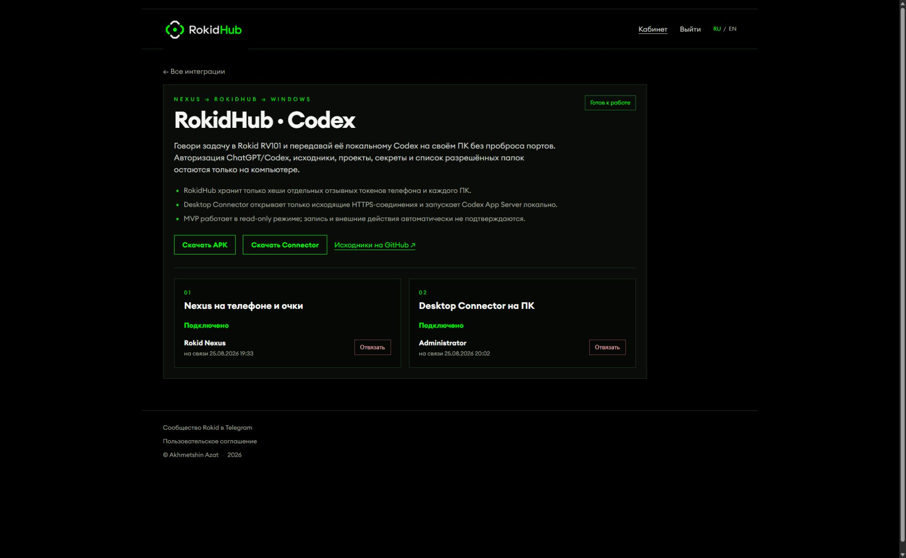

Если после ввода сайт успел принять код, но ещё показывает старую форму, обнови страницу один раз. Повторно использованный одноразовый код уже считается истёкшим — это ожидаемое поведение защиты от повторного предъявления.

## 4. Установи Nexus‑плагин на смартфон

Установи APK через Rokid Nexus. Android‑плагин не заменяет существующую интеграцию `RokidHub · Яндекс`: у него другой plugin id, отдельная привязка и отдельный контракт.

После установки `RokidHub · Codex` появляется в списке плагинов Nexus.

<p align="center">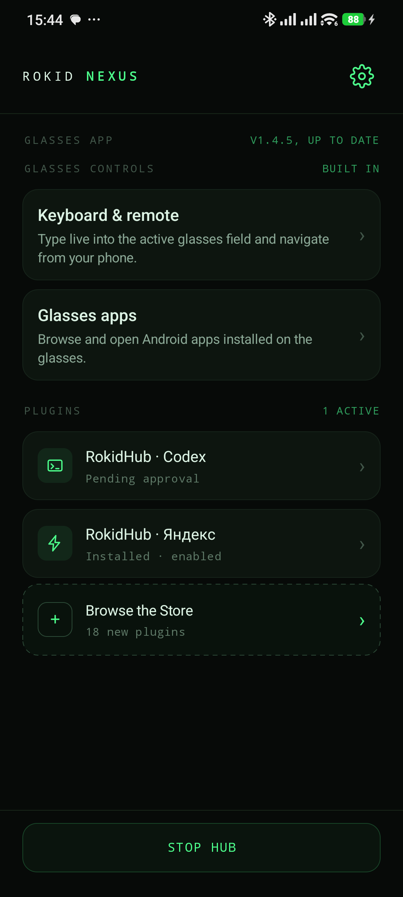</p>

Открой плагин и разреши четыре необходимые возможности:

- **Speech to text** — распознавать речь с микрофона очков;
- **Show on your glasses** — выводить карточки в HUD;
- **Text to speech** — озвучивать короткий итог.
- **Camera** — делать один снимок только после явной голосовой команды.

<p align="center">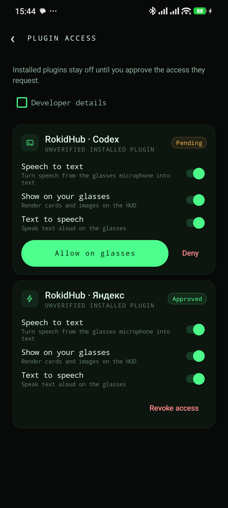</p>

После подтверждения Nexus показывает состояние **Approved**. Любое из разрешений можно позднее отключить в Nexus.

<p align="center">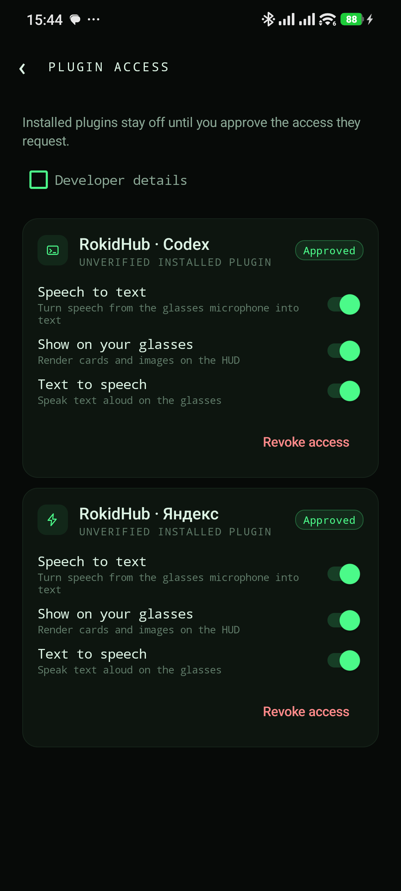</p>

> Если на телефоне уже стояла debug‑сборка с другой подписью, Android не установит release APK поверх неё. Для перехода потребуется удалить debug‑вариант, установить release и привязать плагин заново. Удаление стирает локальный токен плагина, поэтому не делай это посреди важной задачи.

## 5. Привяжи очки

Тройным тапом открой Nexus launcher на очках и выбери **RokidHub · Codex**. При первом запуске HUD покажет одноразовый код. Введи его в тот же раздел **Кабинет → RokidHub · Codex**.

Если очки уже привязаны, поле для их кода скрыто и доступна кнопка **Отвязать**. После отзыва старый токен перестаёт работать, а новый вход снова показывает форму привязки.

## 6. Запусти голосовую задачу

1. Убедись, что в Connector зелёными показаны ПК и очки.
2. Нажми **Запустить Connector**. Он остаётся в трее и ждёт задания исходящим HTTPS‑опросом.
3. Тройным тапом открой Nexus launcher и выбери **RokidHub · Codex**.
4. Нажми/произнеси запрос, например: «Проверь, почему падает тест авторизации, но ничего не меняй».

HUD последовательно показывает:

- **Подключаю ПК** — задание создано и ждёт Connector;
- **Codex анализирует** — локальный App Server выполняет turn;
- **Нужен ответ** — локальному Codex требуется продолжение;
- **Готово** — получена короткая финальная сводка;
- **Остановлено** или **Ошибка** — работа прервана или не завершилась.

В нижней строке мелким шрифтом отображается `Проект: <псевдоним>`. Поток исходного кода, патчи и журналы через TTS не читаются. Голосом озвучивается только короткая итоговая сводка.

## Фото с камеры очков

Скажи, например: «Сделай фото и опиши, что передо мной» или “Take a photo and
inspect the device in front of me”. Плагин явно покажет в HUD **Делаю фото**, а
затем **Отправляю фото**. Слово «фото» само по себе или запрос «найди фото в
проекте» камеру не включает.

За одну команду снимается только один кадр. На телефоне он уменьшается до 2048
пикселей по длинной стороне и повторно сохраняется как JPEG до 5 МБ — исходные
EXIF‑метаданные при этом не переносятся. В RokidHub кадр не получает публичной
ссылки: он привязан к твоим очкам, заданию и выбранному ПК. Connector скачивает
его один раз по текущему lease, проверяет размер и SHA‑256, передаёт локальному
Codex как `localImage` и удаляет временный файл после turn. Hub очищает байты
сразу после скачивания либо по короткому сроку хранения.

Фоновая съёмка, видео, серия кадров и выбор изображения из галереи пока не
поддерживаются.

## Диалог, продолжение и остановка

RokidHub хранит непрозрачный `conversation_id`, а соответствующие идентификаторы Codex thread и активного turn остаются на ПК. Благодаря этому следующие команды продолжают тот же локальный разговор:

| Команда | Что происходит |
|---|---|
| «Продолжай» / “Continue” | создаётся следующий turn в том же thread |
| «Продолжай, проверь ещё тесты» | активный turn получает steer либо продолжается тем же контекстом |
| «Останови» / “Stop” | Connector вызывает локальный `turn/interrupt` |
| «Коротко что нашёл?» / “Give me a short summary” | запрашивается краткая сводка того же разговора |
| «Выбери проект Хаб» | для этого разговора меняется только локально разрешённый корень |

## Локальный журнал

Вкладка **Активность** показывает запуск Connector, проверку Codex и обработку заданий. Журнал не отправляется в RokidHub. В нормальной сборке вывод декодируется как UTF‑8, поэтому русские строки не должны превращаться в `����`.

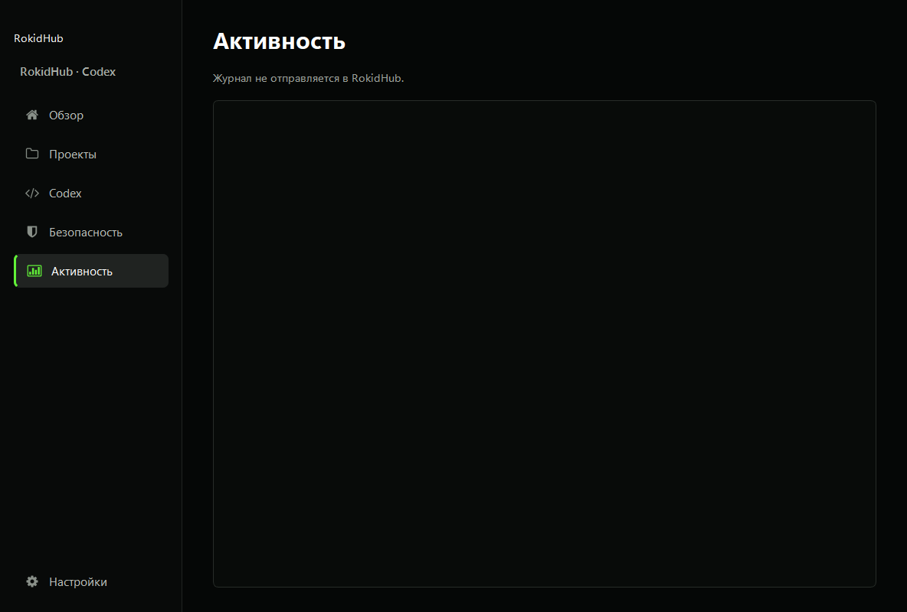

Перед публикацией скриншота журнала проверь его вручную: реальные записи могут содержать имя пользователя Windows или локальный путь. Скриншоты в этой статье сделаны на изолированном демонстрационном профиле.

## Частые проблемы

### «Код не найден или истёк»

Код одноразовый и короткоживущий. Нажми **Привязать ПК** или снова открой непривязанный плагин, получи новый код и вводи его в карточке правильного устройства. Если после первого ввода устройство уже стало зелёным, ошибка при повторном вводе означает, что первый запрос успел сработать.

### На сайте очки привязаны, а Connector пишет обратное

Проверь, что ПК и Nexus привязаны в одном аккаунте RokidHub и что Connector смотрит на тот же Hub, к которому был привязан. После смены адреса Hub компьютер нужно привязать заново. Нажми **Проверить** или перезапусти рабочий цикл.

### Кнопка «Привязать ПК» ничего не делает

Останови текущую операцию Connector. Современная GUI‑версия делает это автоматически: завершает polling, открывает окно кода и запускает отдельное ожидание привязки. Если одновременно работает старый Python‑экземпляр и новый EXE, полностью выйди из старого через трей и оставь один процесс.

### Codex не запускается

Проверь `codex --version`, локальную авторизацию и наличие хотя бы одной существующей разрешённой папки. Включи Mock‑режим, чтобы отдельно проверить Hub и Nexus без App Server.

### SmartScreen предупреждает об EXE

Это известное ограничение beta: EXE пока не подписан Authenticode. Скачивай его только из официального GitHub Release и сверяй SHA‑256. Android APK подписан постоянным релизным ключом проекта.

### Задание просит опасное или внешнее действие

Автоматического выполнения быть не должно. Сеть отключена, доступ ограничен выбранным проектом, а потенциально опасное действие требует локального решения пользователя. Если поведение отличается, останови turn голосовой командой или через Connector и отзови устройство в кабинете.

## Что пока не входит в beta

- передача длинного кода и файлов в Companion PWA;
- автоматическое выполнение опасных, разрушительных или внешних действий;
- входящее подключение к ПК;
- коммерческая подпись Windows EXE и встроенное автообновление;
- произвольное переключение языка внутри одной фразы.

Русский или английский интерфейс Connector выбирается по настройке/языку Windows. Язык STT и текст HUD Nexus выбираются по языку телефона: русский для русской локали, английский для остальных. Это определение языка окружения, а не облачная отправка аудио в RokidHub.

## Быстрая проверка готовности

- [ ] локальный `codex --version` работает;
- [ ] в Connector добавлены только нужные папки;
- [ ] выбран проект по умолчанию и понятные голосовые псевдонимы;
- [ ] установлен безопасный режим доступа;
- [ ] ПК зелёный в Connector и кабинете;
- [ ] Nexus‑плагин получил STT/HUD/TTS/Camera и зелёный в кабинете;
- [ ] Connector запущен и находится в трее;
- [ ] первая задача сформулирована как анализ без записи.

После этого путь готов: очки принимают речь, Nexus создаёт задание, RokidHub безопасно маршрутизирует его нужному компьютеру, а локальный Codex выполняет работу в выбранном проекте и возвращает короткий результат обратно в HUD.
