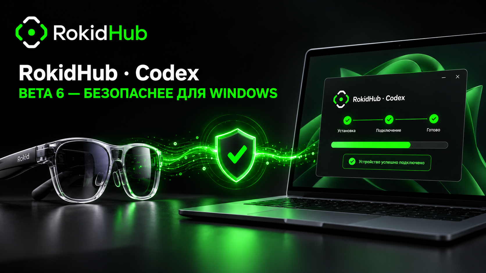

# RokidHub Desktop Connector beta.6: установка стала предсказуемее для Windows



Мы выпустили публичную beta.6 **RokidHub Desktop Connector** — локального моста между Rokid Glasses, RokidHub и Codex на компьютере пользователя. Главная тема обновления — не новые команды для очков, а более понятная и воспроизводимая установка в Windows.

Connector по-прежнему работает по безопасной схеме: сам устанавливает исходящее HTTPS-соединение с RokidHub, не открывает входящие порты и запускает Codex App Server только локально. Авторизация Codex, проекты, исходники, разрешённые папки и защищённый токен Connector остаются на ПК. На сервер уходят только задания, состояния и короткие результаты, необходимые для интерфейса очков.

## Почему антивирус мог насторожиться

Предыдущие beta-сборки распространялись одним самораспаковывающимся EXE, созданным PyInstaller. При каждом запуске такой файл извлекал Python, Qt и остальные компоненты во временную папку с именем `_MEI…`, а затем запускал программу оттуда. Это штатный режим PyInstaller, но похожее поведение используют и вредоносные загрузчики. Новый, редко скачиваемый и пока не подписанный файл дополнительно не имеет репутации в Microsoft SmartScreen и антивирусных облаках.

Поэтому предупреждение само по себе не доказывает заражение, но и игнорировать его вслепую нельзя. До появления Authenticode-подписи правильный ориентир — официальный GitHub-релиз, опубликованный исходный код и точная SHA‑256-сумма файла.

## Что изменилось в beta.6

- Основной вариант загрузки теперь — обычный установщик для текущего пользователя Windows.
- Приложение устанавливается в `%LOCALAPPDATA%\Programs\RokidHub Desktop Connector` и не требует прав администратора.
- Внутри используется папочная сборка PyInstaller `onedir`: Connector больше не распаковывает среду в случайную `_MEI…`-папку при каждом старте.
- Сжатие UPX явно отключено, чтобы не давать эвристике антивируса ещё один подозрительный признак.
- EXE и Setup получили стабильные имя продукта, описание, номер версии и фирменную иконку RokidHub.
- Защита от повторного запуска не позволяет создать две одинаковые иконки Connector в трее.
- Старая запись автозагрузки при необходимости переводится на установленный EXE.
- Конфигурация и DPAPI-защищённый токен сохраняются при обновлении поверх предыдущей beta.
- Вместе с Setup публикуются portable ZIP и файл `SHA256SUMS.txt`.
- Windows-пакеты собираются из зафиксированных зависимостей в публичном GitHub Actions workflow.

Эти изменения уменьшают количество эвристических срабатываний и делают происхождение сборки проверяемым. Они не заменяют цифровую подпись: SmartScreen всё ещё может написать «Неизвестный издатель», особенно пока релиз новый и его скачало мало людей.

## Как установить

1. Открой [официальный релиз v0.6.0-beta.6](https://github.com/lavAzza2/rokidhub-codex/releases/tag/v0.6.0-beta.6).
2. Для обычной установки скачай `RokidHub-Desktop-Connector-v0.6.0-beta.6-setup.exe`.
3. При обновлении сначала закрой старый Connector через иконку в трее → **Выход**, затем запусти Setup. Локальная привязка и настройки сохранятся.
4. После запуска открой **Настройки**, привяжи ПК одноразовым кодом в кабинете RokidHub и выполни проверку соединения.

Portable ZIP предназначен для диагностики и ручного запуска. Его нужно полностью распаковать и запускать `RokidHub Desktop Connector.exe` из полученной папки — не прямо из архива.

## Что делать с предупреждением SmartScreen

Сначала проверь, что файл получен именно из релиза `lavAzza2/rokidhub-codex`, и сравни SHA‑256. Для Setup beta.6 она равна:

```text
1b37c954d511f2f65f7e330ba0e000cb473980e5a9d9deac03209284ed1b7b39
```

В PowerShell:

```powershell
Get-FileHash .\RokidHub-Desktop-Connector-v0.6.0-beta.6-setup.exe -Algorithm SHA256
```

Если сумма совпала, в стандартном окне SmartScreen можно открыть **Подробнее** и выбрать **Выполнить в любом случае**. Не отключай антивирус и не добавляй целые папки в исключения.

Если сторонний антивирус уже переместил файл в карантин, сначала запиши название продукта и точное имя детекта. Восстанавливать файл имеет смысл только после совпадения SHA‑256 с официальным релизом. Отправь эти данные в [GitHub Issues](https://github.com/lavAzza2/rokidhub-codex/issues) — так конкретный артефакт можно передать производителю антивируса как возможное ложное срабатывание.

## Что мы проверили перед публикацией

- 38 автоматических тестов Desktop Connector;
- 31 тест backend-контрактов привязки и заданий RokidHub;
- Android unit tests и release-сборку Nexus-плагина;
- воспроизводимую сборку Setup и portable ZIP в GitHub Actions;
- обновление поверх установленной версии в Windows;
- сохранение DPAPI-токена и локальной конфигурации;
- полный production-путь: отзыв старого ПК, новый одноразовый код, привязка в кабинете `rokidhub.com`, авторизованный health check и запуск polling.

Все обязательные проверки прошли. В кабинете RokidHub ссылка на Connector уже ведёт на beta.6.

## Что дальше

Следующий крупный шаг для Windows-дистрибутива — Authenticode-подпись с доверенной временной меткой. Она даст издателю проверяемое имя и поможет SmartScreen быстрее формировать репутацию. До этого момента мы продолжаем публиковать исходники, воспроизводимый workflow, контрольные суммы и отдельные release-артефакты.

- [Скачать beta.6](https://github.com/lavAzza2/rokidhub-codex/releases/tag/v0.6.0-beta.6)
- [Исходный код и инструкции](https://github.com/lavAzza2/rokidhub-codex)
- [Сообщить о проблеме или ложном срабатывании](https://github.com/lavAzza2/rokidhub-codex/issues)
